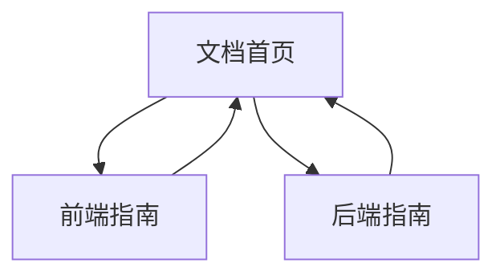

## 重要说明
本 PRD 最初以“React Web 前端”为前提生成；当前仓库已按你的最新需求调整为“基于 Taro 的微信小程序”。
请优先参考 [PRD_Monorepo_TaroMiniApp_Node.md](file:///Users/bytedance/code/logic-player/.trae/documents/PRD_Monorepo_TaroMiniApp_Node.md)。

## 1. Product Overview
为一个面向开发者的 Monorepo 项目模板，统一管理 Taro 微信小程序（React+TypeScript）与 Node.js+TypeScript 后端。
目标是让你用一致的目录、脚本与规范完成开发、构建与运行。

## 2. Core Features

### 2.1 Feature Module
本项目文档站点需求由以下主要页面构成：
1. **文档首页**：项目概览、目录结构预览、快速开始。
2. **前端指南**：前端开发/构建/运行方式、环境变量、路由与接口调用约定。
3. **后端指南**：后端开发/构建/运行方式、API 约定、跨包共享类型与错误码规范。

### 2.3 Page Details
| Page Name | Module Name | Feature description |
|-----------|-------------|---------------------|
| 文档首页 | 项目概览 | 展示项目目标、技术栈、适用场景与约束（monorepo、TS 统一规范）。 |
| 文档首页 | 快速开始 | 指引你完成：安装依赖 → 启动开发环境 → 构建产物 → 本地运行产物。 |
| 文档首页 | 目录结构 | 说明根目录与各 workspace/package 职责，给出关键路径示例与命名约定。 |
| 前端指南 | 开发与构建 | 说明小程序启动、预览、类型检查、构建与产物输出位置。 |
| 前端指南 | 配置约定 | 说明前端环境变量命名、API Base URL 读取优先级与本地开发默认值。 |
| 前端指南 | 与后端联调 | 说明请求封装、共享 types 导入方式、错误处理与本地代理/跨域处理方式。 |
| 后端指南 | 开发与构建 | 说明后端启动、自动重启、类型检查、构建与产物输出位置。 |
| 后端指南 | API 约定 | 说明路由组织、请求/响应 JSON 结构、错误码与日志字段最小集合。 |
| 后端指南 | 共享代码 | 说明如何复用 shared 包（类型、校验、常量），以及版本与依赖边界原则。 |

## 3. Core Process
你（开发者）主要流程：
1) 阅读文档首页了解 monorepo 目录与脚本入口。
2) 按快速开始完成依赖安装，并分别启动前端与后端的开发模式。
3) 根据前端指南与后端指南约定进行联调：前端调用后端 API，并从 shared 包复用类型。
4) 需要交付时在根目录执行构建，随后按运行方式验证构建产物。

