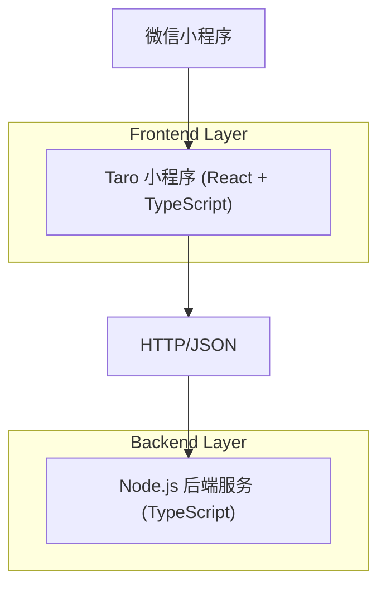
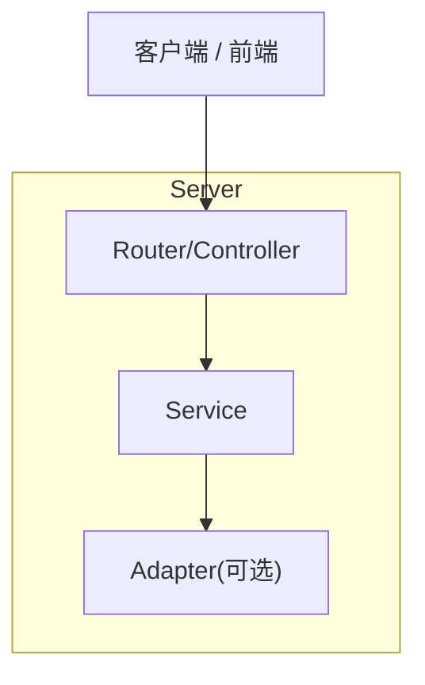

## 重要说明
本架构文档最初以“React Web 前端”为前提生成；当前仓库已按你的最新需求调整为“基于 Taro 的微信小程序”。
请优先参考 [TechArch_Monorepo_TaroMiniApp_Node.md](file:///Users/bytedance/code/logic-player/.trae/documents/TechArch_Monorepo_TaroMiniApp_Node.md)。

## 1.Architecture design


## 2.Technology Description
- Frontend: Taro@4 + React@18 + TypeScript
- Backend: Node.js + TypeScript + Express（或等价 HTTP 框架）
- Monorepo: Workspace（建议 pnpm workspaces 或 npm/yarn workspaces 其一）
- Tooling: ESLint + Prettier + TSConfig project references（可选，用于跨包类型更快）

## 3.Route definitions
| Route | Purpose |
|-------|---------|
| / | 文档首页：概览、快速开始、目录结构入口 |
| /frontend | 前端指南：开发/构建/运行、联调约定 |
| /backend | 后端指南：开发/构建/运行、API 约定 |

## 4.API definitions (If it includes backend services)
### 4.1 Core API
健康检查
```
GET /api/health
```
Response（示例）
```json
{ "ok": true }
```

共享 TypeScript 类型（由 packages/shared 提供）
```ts
export type ApiResponse<T> = {
  ok: boolean;
  data?: T;
  error?: { code: string; message: string };
};
```

## 5.Server architecture diagram (If it includes backend services)


## 6.Data model(if applicable)
本项目不强制引入数据库（早期最小可用）；如后续需要持久化，可再补充数据模型与权限策略。

## 7.Monorepo 目录结构（约定）
> 以 root + packages 的形式组织，shared 用于前后端共享。

- /packages
  - /web：React 前端（Vite）
  - /api：Node 后端（HTTP API）
  - /shared：共享 types/常量/校验逻辑（纯 TS，无运行时副作用）
- /configs（可选）：eslint/tsconfig/prettier 等统一配置
- package.json：根脚本入口与 workspace 配置

## 8.开发 / 构建 / 运行方式（脚本口径）
> 以下为推荐的统一脚本命名，你可以映射到 pnpm/npm/yarn。

根目录脚本（示例语义）
- dev：同时启动 web 与 api（开发模式、热更新）
- build：分别构建 web 与 api 产物
- start：运行构建产物（生产模式本地验证）
- typecheck：全仓类型检查
- lint / format：代码规范与格式化

各包脚本（示例语义）
- packages/web
  - dev：Vite dev server
  - build：Vite build（输出到 dist/）
  - preview 或 start：本地预览 dist
- packages/api
  - dev：ts-node/tsx + watch（或 nodemon）
  - build：tsc 输出到 dist/
  - start：node dist/index.js

环境变量口径（最小集合）
- Web：VITE_API_BASE_URL（指向后端 base url）
- API：PORT（监听端口），LOG_LEVEL（日志级别，可选）
